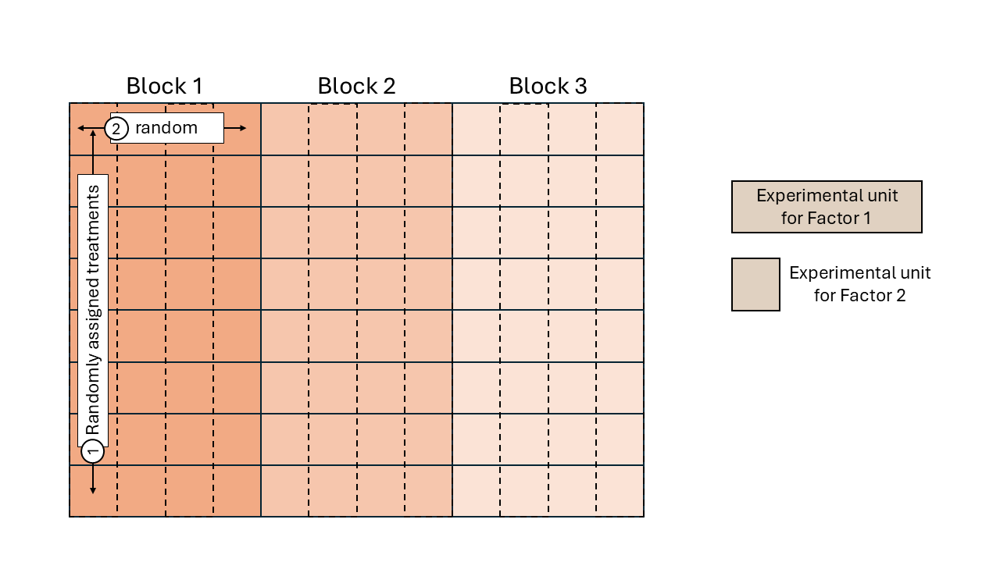
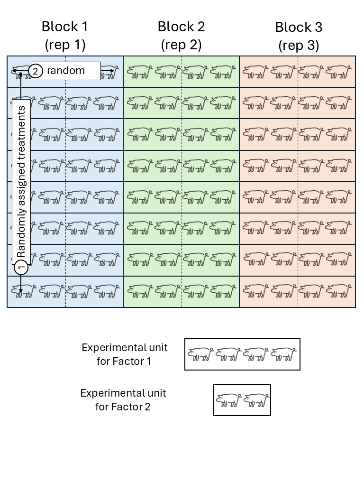

# Review: hierarchical multilevel models -- cont. 

June 22nd, 2026

## Hierarchical designs 

A study was designed to determine the effect on the incidence of root rot, of variety of wheat, kinds of dust for seed treatment, method of application of the dust, and efficacy of soil inoculation with the root-rot organism. 
We have a data frame with 160 observations on the following 8 variables that describe a designed experiment: 

- `row` row: equivalent to "longitude" in the field coordinates 
- `col` column: equivalent to "latitude" in the field coordinates 
- `yield` yield: response variable 
- `inoc` inoculate: indicator whether soil was inoculated with root rot or not  
- `gen` genotype treatment
- `dust` dust treatment 
- `dry` dry or wet dust application 
- `block` block: the field was divided in 4 equally-sized subsections that showed approximately similar characteristics. 

Note that:

- The field has 4 areas of similar experimental units (blocks). 
- Within each block, the genotype treatments were applied. 
- Within each block-genotype, the dry-dust treatments were applied. 
- Within each block-genotype-dry-dust, the inoculation treatments were applied. 


```{r}
url <- "https://raw.githubusercontent.com/stat720/summer2026/refs/heads/main/data/data_inclass_06182026.csv"
df <- read.csv(url)
```


## Review  

```{r echo=FALSE, fig.cap="Mind map", out.width = '100%'}
knitr::include_graphics("../figures/mindmap2.jpg")
```

### Treatment structure

- What treatment factor(s) and/or combinations of treatment factors we've got.   
- Typically defines the fixed effects in a model. 

### Design structure

- How we apply said treatment factors in practice (what are the experimental units?).   
- Typically defines the random effects in a model. 

**Hierarchical designs** 

- Typically, different treatment factors have different EUs. 
- Therefore, randomization ocurrs in nested structures.  


```{r echo=FALSE, fig.cap="Schematic description of a field experiment with a split-plot design", out.width = '100%'}

```

```{r echo=FALSE, fig.cap="Schematic description of a swine experiment with a split-plot design", out.width = '70%'}

```


- The most common statistical model assumes: 
  - Constant variance, 
  - Normality, 
  - **Independence** -- this changes with hierarchical designs! That's why we use mixed models. 


## Exercises 

**Data structure** 

1. Draw a figure of the structure in the data. Do not consider the treatments yet.  

**Designed experiment** 

2a. Draw a figure of the different randomization steps. 
2b. Indicate the experimental units for the different treatment factors. 
2c. How many observations do you have for each treatment factor? 
2d. What are the treatment structure and the design structure? 

Recall from day 2: 


```{r echo=FALSE, fig.cap="Fisher’s diagram ‘The Principles of Field Experimentation’. Figure 1 in [Preece (1990)](https://doi.org/10.2307/2532438).", out.width = '70%'}
knitr::include_graphics("../figures/fisher_diagram.jpg")
```


**Stat model**  

3a. Write the statistical model that describes the data generating process. 
3b. Fit the model in (3) to the data using R. 

**Bonus**  

4. How would you name this experiment design? 


