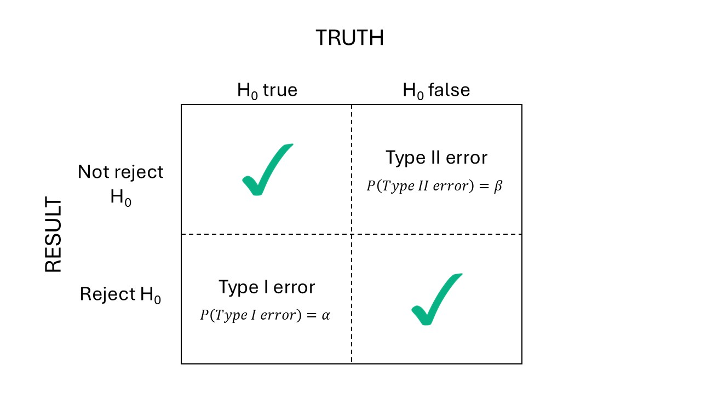

# Power and precision analyses

```{r include=FALSE}
library(tidyverse)
library(lme4)
library(agridat)
```

## Announcements 

- Find today's recording in your K-State email inbox. 
- HW2 grades are posted -- you can resubmit **once** for full points. 
- Some anxillary videos can be found in the STAT 720 channel now. 

## What is statistical power? 

- Aims to represent the ability of an experiment to make a "scientific discovery", provided there really is one to make. 
- ...We need experiments with power $\geq$ 80%. 
- Typically used to define the number of repetitions needed to achieve enough power. 
- Strongly influenced by the "hypothesis tests" mentality -- blame [Mr. Popper](https://en.wikipedia.org/wiki/Karl_Popper)! 
- Also strongly influenced by the p<0.05-chasing mentality -- who's to blame for this? Blame all of us! 
- Often the "golden standard" when proposing an experiment. 
- Can be replaced by a precision analysis, which is slightly less p-value based.

```{r echo=FALSE, fig.cap="Error types in classic hypothesis testing.", out.width = '100%', fig.align='center'}

```

We normally control $\alpha$, the probability of doing an error of type I. 
TO describe our experiment's ability to detect scientific discoveries, we consider power: the $P(\text{reject } H_0 | H_0 \text{ false}) = 1- \beta$. 


## Review: t-test 

- Used to evaluate differences between treatment effects or means. 
- Example testing against zero: $t^{\star} = \frac{\hat\theta - 0}{s.e.(\hat\theta)} = \frac{\hat\theta - 0}{s.d.(\hat\theta)/\sqrt{n}}$ 
- Note the sensibility to sample size. 
- Also, remember the $s.e.(\hat\theta)$ may differ depending on the design:
  - $s.e.(\hat\theta)$ may depend on $\sigma^2_\varepsilon$ only (e.g., CRD, RCBD, mean comparisons between treatment levels of the treatment at the split-plot level), $s.e.(\hat\theta) = \sqrt{\frac{2 \sigma^2_{\varepsilon}}{r}}$. 
  - $s.e.(\hat\theta)$ may depend on $\sigma^2_\varepsilon$ and $\sigma^2_{whole \ plot}$ (e.g., mean comparisons between treatment levels of the treatment at the whole-plot level), $s.e.(\hat\theta) = \sqrt{\frac{2 (\sigma^2_{\varepsilon} + b \cdot \sigma^2_w)}{b \cdot r}}$


## Power calculations -- Analytic approach 

### Sample size calculation 

**To detect a difference** $\delta$: 
$$r = \frac{2\hat{\sigma}^2}{\delta^2}[t_{\alpha/2, \nu} + t_{\beta, \nu}]^2,$$
where: 

- $r$ is the sample size (i.e., number of reps), 
- $\hat\sigma^2$ is the estimate of $\sigma^2$ based on $\nu$ degrees of freedom, 
- $\alpha$ is the type I error rate, 
- $\beta$ is the type II error rate, 
- And note that: $Var(\delta)=2\sigma^2/r$, which leads to $s.e.(\delta)=\sqrt{\frac{2\sigma^2}{r}}$.
- See page 455 in Milliken and Johnson. 


### Power evaluation  

The sample size calculation can be used to evaluate the power by solving for $t_{\beta, \nu}$ and then determining the power as $1-\beta$. Then, the equation for $t_{\beta, \nu}$ is 

$$t_{\beta, \nu} = \sqrt{\frac{r \delta^2 }{2\sigma^2}} - t_{\alpha/2, \nu}$$

### Applied case I (from last week)

This was a CRD with $\sigma^2_\varepsilon = 204$.

Because this is a CRD, the model is 

$$y_{ijk} = \mu_0 + T_i + D_j +(T\times D)_{ij} + \varepsilon_{ijk}, \\  \varepsilon_{ijk} \sim N(0, \sigma^2).$$

```{r}
url <- "https://raw.githubusercontent.com/stat720/summer2026/refs/heads/main/data/blood_study_pigs.csv"
df <- read.csv(url) |>  mutate(Trt = as.factor(Trt), Day = as.factor(Day))

m <- lm(Serum_haptoglobin_mg.dL ~ Trt*Day, data = df)

# this is all we need
(sigma2_m1 <- sigma(m)^2)
```

**After-the-fact power analysis**

We can assume: 

```{r}
# get t_{alpha/2}
alpha <- .05
df <- m$df.residual

qt(alpha/2, df)
```

- $\sigma^2_\varepsilon = 204$ 
- $\delta = 40$ 
- $t_{\alpha/2, \nu} = 1.97$ (see above)
- $r = 16$

Then, 

$$t_{\beta, \nu} = \sqrt{\frac{r \delta^2 }{2\sigma^2}} - t_{\alpha/2, \nu} = \sqrt{\frac{16\cdot 1600 }{408}} - 1.97 = 6.27.$$

```{r}
delta <- 40
n_reps <- 16
t_beta <- sqrt(n_reps*delta^2 / (2*sigma2_m1)) - 1.97
df <- m$df.residual

(beta <- pt(-t_beta, df))
(power <- 1-beta)
```

Our study had a very large power to detect differences of 40 mg/dL. 


### Applied case II 

Because this is an RCBD, the model is 

$$y_{ij} = \mu_0 + T_i + b_j + \varepsilon_{ij}, \\  \varepsilon_{ij} \sim N(0, \sigma^2).$$

Let's assume random blocks: $b_j \sim N(0, \sigma^2_b)$.


```{r}
url <- "https://raw.githubusercontent.com/stat720/summer2026/refs/heads/main/data/cochrancox_kfert.csv"
df2 <- read.csv(url) |> 
  transmute(K2O_lbac = as.factor(K2O_lbac), rep = as.factor(rep), yield)
m_random <- lmer(yield ~ K2O_lbac + (1|rep), data = df2)
```

**After-the-fact power analysis**

Remember that all we need is the $\sigma^2_\varepsilon$, because the block variance is not part of the mean comparisons.  

We can assume: 

```{r}
sigma(m_random)^2

# get t_{alpha/2}
alpha <- .05
df <- (n_distinct(df2$K2O_lbac) - 1) * (n_distinct(df2$rep) - 1)

qt(alpha/2, df)
```

- $\sigma^2_\varepsilon = 0.044$ 
- Try $\delta = 0.50$ and $\delta = 0.25$
- $t_{\alpha/2, \nu} =  2.31$ (see above)
- $r = 3$


Then, 

$$t_{\beta, \nu} = \sqrt{\frac{r \delta^2 }{2\sigma^2}} - t_{\alpha/2, \nu} = \sqrt{\frac{3 \cdot \delta^2 }{0.044}} - 2.31 = 2.27.$$

Power for $\delta = 0.50$ 
```{r}
t_beta <- sqrt(3*(.50^2) / .044) - 2.31

(beta <- pt(-t_beta, df))
(power <- 1-beta)
```

Power for $\delta = 0.25$ 
```{r}
t_beta <- sqrt(3*(.25^2) / .044) - 2.31

(beta <- pt(-t_beta, df))
(power <- 1-beta)
```
Our study did not had enough statistical power to detect differences of 0.5, but not 0.25. 


### Applied case III 

Because this is a split-plot design, the model is 

$$y_{ij} = \mu_0 + F_i + G_j + (F\times G)_{ij} + b_k + wp_{i(k)} + \varepsilon_{ij}, \\
wp_{i(k)}, \sim N(0, \sigma_{wp}^2) \\ \varepsilon_{ij} \sim N(0, \sigma^2_\varepsilon).$$

- Like before, we can choose either fixed or random for $b_k$. 
- But now, the se(mean) depend on the level we are looking.  

For differences at the whole-plot level (fung) we had: $se(\hat\mu-\mu') = \sqrt{\frac{2(\sigma^2_\varepsilon + g \ \sigma^2_{wp})}{b \cdot g}}$. 
For differences at the split-plot level (gen) we had: $se(\hat\mu-\mu') = \sqrt{\frac{2(\sigma^2_\varepsilon)}{b \cdot f}}$. 

```{r message=F}
df3 <- durban.splitplot

m3 <- lmer(yield ~ fung*gen + (1|block/fung), data = df3)


# degrees of freedom (from class)
m3_df <- c(3, 414, 414)
names(m3_df) <- c("fung", "gen", "fung:gen")
```

**After-the-fact power analysis at the split-plot level**

Remember that all we need is the $\sigma^2_\varepsilon$, because the block variance and whole-plot variance are not part of the mean comparisons at this level.  


Remember that $Var(\hat\mu-\mu') = \frac{2(\sigma^2_\varepsilon)}{b \cdot f}$ and $se(\hat\mu-\mu') = \sqrt{\frac{2(\sigma^2_\varepsilon)}{b \cdot f}}$. 
We can assume: 

```{r}
sigma2_m3 <- sigma(m3)^2

# get t_{alpha/2}
alpha <- .05
df_e <- m3_df["gen"]

qt(alpha/2, df_e)
```

- $\sigma^2_\varepsilon = 0.08$ 
- $\delta = 0.40$
- $t_{\alpha/2, \nu} =  1.96$ (see above)
- $r = blocks \cdot fung = 4 \cdot 2$


Then, 

$$t_{\beta, \nu} = \sqrt{\frac{r \delta^2 }{2\sigma^2}} - t_{\alpha/2, \nu} = \sqrt{\frac{8 \cdot \delta^2 }{0.16}} - 1.96 = 2.27.$$

Power for $\delta = 0.40$ 
```{r}
diff <- .4
n_fung <- 2
n_reps <- 4

t_beta <- sqrt((n_reps*n_fung)*(diff^2) / (2*sigma2_m3)) - 1.96

(beta <- pt(-t_beta, df_e))
(power <- 1-beta)
```


**After-the-fact power analysis at the whole-plot level**

Now we need the $\sigma^2_\varepsilon$ AND $\sigma^2_{wp}$, because the block variance variance is not part of the mean comparisons at this level, but the whole-plot variance is!  


Remember that $Var(\hat\mu-\mu') = \frac{2(\sigma^2_\varepsilon + g \ \sigma^2_{wp})}{b \cdot g}$ and $se(\hat\mu-\mu') = \sqrt{\frac{2(\sigma^2_\varepsilon + g \ \sigma^2_{wp})}{b \cdot g}}$. 


We can assume: 

```{r}
sigma2_m3 <- sigma(m3)^2
sigma2wp_m3 <- VarCorr(m3)$`fung:block`[1]


# get t_{alpha/2}
alpha <- .05
df_e <- m3_df["fung"]

t_alpha <- qt(1-alpha/2, df_e)
```

- $\sigma^2_\varepsilon = 0.08$ 
- $\sigma^2_{wp} = 0.014$ 
- $\delta = 0.40$
- $t_{\alpha/2, \nu} =  3.18$ (see above)
- $r = blocks \cdot gen = 4 \cdot 70$

Then, 

$$t_{\beta, \nu} = \sqrt{\frac{r \delta^2 }{2(\sigma^2_\varepsilon + g \ \sigma^2_{wp}) }} - t_{\alpha/2, \nu} = \sqrt{\frac{280 \cdot \delta^2 }{2.09}} - 3.18 = 1.45.$$

Power for $\delta = 0.40$ 
```{r}
diff <- .4
n_gen <- 70
n_reps <- 4

t_beta <- sqrt((n_reps*n_gen)*(diff^2) / (2*(sigma2_m3 + n_gen*sigma2wp_m3))) - t_alpha

df_e <- m3_df["fung"]

(beta <- pt(-t_beta, df_e))
(power <- 1-beta)
```

## Precision analysis as an alternative to power analysis 

Advantages: 

- Relies less on the p-value<0.05 paradigm. 
- Does not depend on a pre-determined difference. 
  - Otherwise, power is directly dependent on the effect size and we might be overconfident about our design. 

For example: for Model 1 (CRD) 
```{r}
sigma2_m1 <- sigma(m)
t_alpha_m1 <- qt(1 - alpha/2, m$df.residual)

#get se
sqrt(2*sigma2_m1/16) * t_alpha_m1
```


## Tomorrow 

- Power analysis -- simulation approach  
- In-class activity
