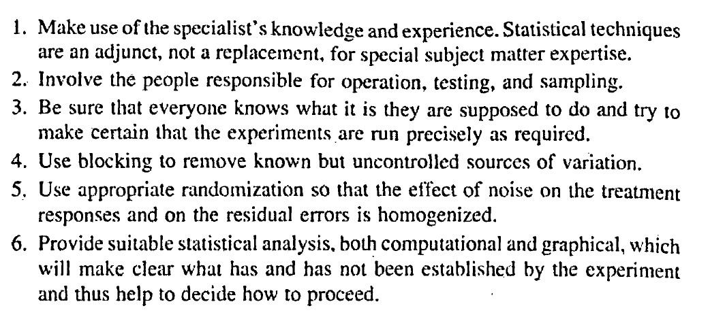

# Wrap-up I 

## Announcements 

- Return your feedback by July 17th 
- Please answer TEVALs! I'm very interested in your feedback 
- No office hours today -- please email me if you'd like to meet 


## Principles for conducting valid and efficient experiments 

```{r echo=FALSE, fig.cap="'Principles for conducting valid and efficient experiments'. From Box, Hunter and Hunter (2005).", out.width = '60%', fig.align='center'}

```

## Modeling data generated by designed experiments  

- The most common model that is the default in most software: $y_{ij} = \mu + T_i + \varepsilon_{ij} , \ \varepsilon_{ij}\sim N(0, \sigma^2)$. 
  - Independence 
  - Constant variance 
  - Normal distribution 
- Designed experiments sometimes handle EUs in groups, leaving us with groups of data that have something in common rather than being independent. 
- Different patterns of "similar groups" lead to us calling them different designs. 
  - Blocked designs - randomized complete block designs, incomplete block designs 
  - Multilevel designs: split-plot designs, multi-location designs, subsampling, etc.
  - Crossover designs 
  - Repeated measures (Time is one of the treatment factors) 
    - Comment: repeated measures in SAS and in R 
  - What is what? Sketch it! 
- Inter-block recovery of information for incomplete block designs 
- One model versus dividing the data  
- The importance of writing the statistical model! 

### From ANOVA table to statistical model  

```{r echo=FALSE, message=FALSE, warning=FALSE}
t_design <- data.frame(Source = c("House (block)", "-", "Error(recipe)", 
                                  "Error(oven x day)", "Total"),
                       df = c("b-1", "-", "(r-1)*b",
                              "(s-1) * r * b", "N-1"))

t_trt <- data.frame(Source = c("-", "Recipe", "-", 
                               "Parallels", "Total"),
                    df = c("-", "r-1", "-",
                           "N-r", "N-1"))

t_rcbd <- data.frame(Source = c("House", "Recipe", "Error(recipe)",
                                "Error(muffin)", "Total"),
                    df = c("b-1", "r-1", "(r-1)*b - (r-1)",
                           "(s-1) * r * b - (N-r)", "N-1"))

knitr::kables(
  list(
    knitr::kable(t_design, caption = "Design or Topographical Sources of Variability"),
    knitr::kable(t_trt, caption = "Treatment Sources of Variability"),
    knitr::kable(t_rcbd, caption = "Combined Table of the Sources of Variability")
  ),
  caption = 'Example ANOVA for the muffin experiment example'
)
```

The statistical model corresponding to this ANOVA table was 
$$y_{ijk} = \mu + b_j + R_i + w_{i(j)} + \varepsilon_{ijk},$$
where: 

- $y_{ijk}$ is the observation of the height of the $k$th muffin from the $i$th recipe baked in house $j$, 
- $\mu$ is the overall mean, 
- $b_j$ is the effect of house $j$,
- $R_i$ is the effect of the $i$th recipe, 
- $w_{i(j)}$ is the effect of over at the $i$th recipe in house $j$,  
- $\varepsilon_{ijk}$ is the residual for the height of the $k$th muffin from the $i$th recipe baked in house $j$. 

- Effects model versus Means model 

### What happens if we drop blocks, split-plots, etc? 

**What if the elements of the design (blocks, whole plots) are not significant?** 

- Interpreting a small variance component (e.g., $\sigma^2_b$ ) vs. a non-significant fixed effect (i.e., $p_B >0.05$ ) 
- Currently, the general advice is to include the randomization structure to avoid type I error deflation -- see "[Analyze as randomized -- Why dropping block effects in designed experiments is a bad idea (Frey et al., 2024)](https://acsess.onlinelibrary.wiley.com/doi/full/10.1002/agj2.21570)" 
- Review on split-plot designs, EU sizes, and subsampling/pseudoreplication. 

### What happens if we drop split-plots or fail to model the subsampling structure? 

- Pseudo-replications are mis-identified as true replicates. 
- Overconfidence about CI and p-values 
- Inflation of type I error!


### Differences modeling multi-location designed experiments  

- Random effects versus fixed effects assumptions  
- Remember that you are designing a model that describes how the data were generated, not using the model that will fit the results you hope to get. 
- See [Gelman (2005)](https://projecteuclid.org/journals/annals-of-statistics/volume-33/issue-1/Analysis-of-variancewhy-it-is-more-important-than-ever/10.1214/009053604000001048.full) - page 20. 

**Example: sites that are somewhat different** 

- An argument against "On the other hand, modeling location as a fixed effect restricts inference to those specific locations only. Therefore, if the goal is to make inferences across a broader region or range of conditions, treating location as a random effect is the preferred approach." 

```{r fig.height=4, fig.width=4}
df_env2 <- agridat::blackman.wheat %>% filter(loc %in% c("Cra", "Beg", "Edn"))
str(df_env2)

m_fixed <- lm(yield ~ nitro*type + loc, data = df_env2)
m_random <- lmer(yield ~ nitro*type + (1|loc), data = df_env2)
```

The marginal means look the same...  
```{r}
emmeans(m_fixed, ~ nitro:type)
emmeans(m_random, ~ nitro:type)
```

... but the CI is **sooooo** much wider for the mean of the mixed model! 

```{r}
as.data.frame(emmeans(m_fixed, ~ nitro:type)) %>% 
  mutate(CI_width = upper.CL-lower.CL)
as.data.frame(emmeans(m_random, ~ nitro:type)) %>% 
  mutate(CI_width = upper.CL-lower.CL)
```

Now let's take a look at the residual quantiles: 

```{r fig.height=4, fig.width=4}
simres1 <- DHARMa::simulateResiduals(m_fixed, plot = F)
DHARMa::plotQQunif(simres1, main = "QQ plot residuals - fixed model")

simres2 <- DHARMa::simulateResiduals(m_random, use.u = F)
DHARMa::plotQQunif(simres2, main = "QQ plot residuals - mixed model w/o RE")

simres3 <- DHARMa::simulateResiduals(m_random, use.u = T)
DHARMa::plotQQunif(simres3, main = "QQ plot residuals - mixed model")
```

What is happening?? 


## Tomorrow 

- Wrap-up II 

